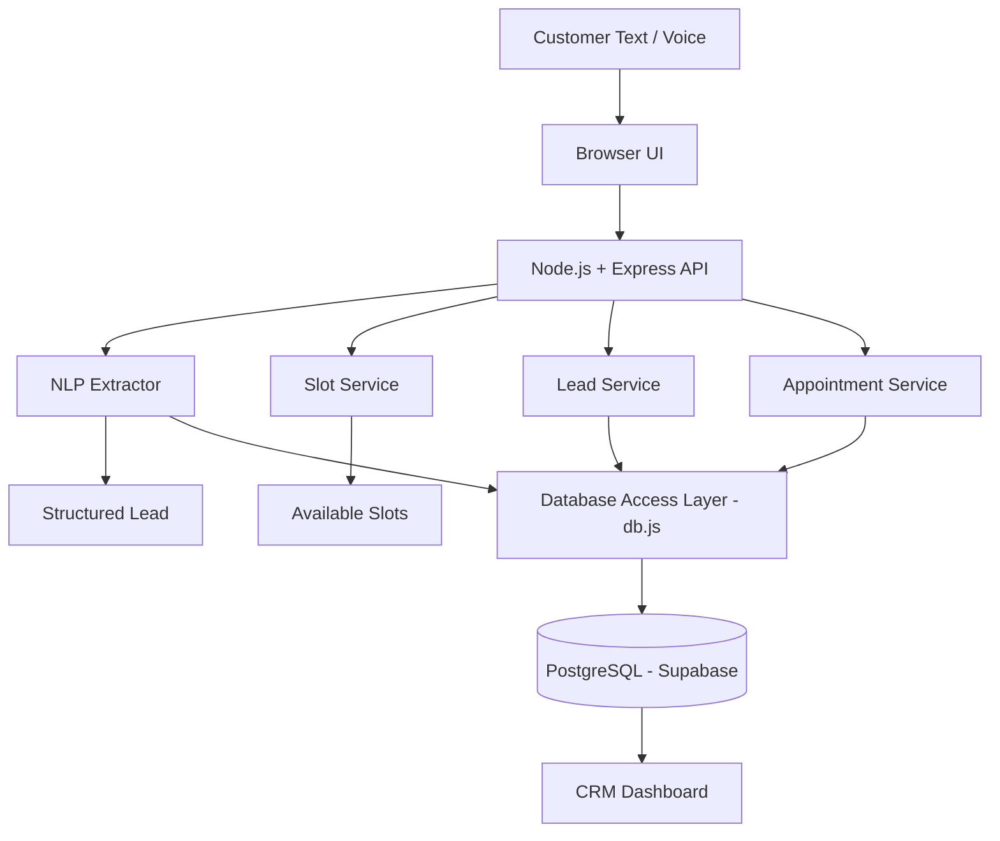

# DISPATCH — AI Calling & CRM Demo

A 24-hour SDE take-home assignment demonstrating the ability to connect AI/NLP processing, backend logic, data storage, CRM workflow, and basic voice interaction.

## Problem Statement

Build a small working application that demonstrates:
1. AI/NLP processing for customer message analysis
2. Backend logic with REST APIs
3. Data persistence with local storage
4. CRM workflow for lead management
5. Basic voice interaction using browser APIs

**Assignment brief (Mini AI Lead + CRM System):**
1. Extract the customer's **name, requirement, and lead status** from a message.
2. Show **3 available meeting slots** (mock slots acceptable).
3. After a slot is selected, save the **contact, lead, conversation, and appointment**.
4. Create a simple **CRM dashboard** where these records can be viewed.
5. Add a basic **Voice Demo** option (browser microphone/speech or simulated voice flow — real telephone calling not required).
6. No paid services — free tiers, open-source tools, local models, or mock data only.

## Solution Overview

DISPATCH is a full-stack application that processes customer messages through a rule-based NLP extractor to identify leads, requirements, and meeting requests. It provides an intuitive intake workflow for booking appointments and a professional CRM dashboard for managing leads and appointments.

## Features

- **Customer Message Analysis**: Rule-based NLP extraction to identify customer name, requirements, lead status, and priority
- **Dynamic Meeting Slots**: Generates available time slots based on customer-requested dates
- **Appointment Booking**: Complete booking workflow with contact, lead, conversation, and appointment persistence
- **CRM Dashboard**: Professional dashboard with lead statistics, lead table, and detailed lead views
- **Voice Demo**: Browser-based speech recognition and synthesis for voice interaction
- **No Paid Services**: Uses only local/rule-based NLP and browser-native APIs

## Tech Stack

### Backend
- **Node.js** - JavaScript runtime
- **Express.js** - Web framework
- **PostgreSQL (via Supabase)** - Managed relational database for data persistence
- **pg (node-postgres)** - PostgreSQL client/connection pooling

### Frontend
- **HTML5** - Markup
- **CSS3** - Styling with custom dark theme
- **Vanilla JavaScript** - No frameworks

### APIs
- **Web Speech API** - Speech recognition and synthesis
- **REST API** - Custom backend endpoints

## Architecture

### System Architecture



This maps directly to the assignment requirements: **NLP Extractor** covers requirement 1 (name/requirement/status extraction), **Slot Service** covers requirement 2 (3 available slots), **Lead/Appointment Services + Database Access Layer** cover requirement 3 (persisting contact, lead, conversation, appointment), the **CRM Dashboard** covers requirement 4, and the **Browser UI**'s voice mode (via the Web Speech API) covers requirement 5.

> **Migration note**: The application originally used local JSON files (`data/*.json`) for persistence. It has since been upgraded to **PostgreSQL, hosted on Supabase**, for proper relational integrity, concurrent access, and production-readiness. The service/API layer (`leadService.js`, `appointmentService.js`, `nlpExtractor.js`, `slots.js`) is unchanged — only `db.js` was rewritten to issue SQL queries against Postgres instead of reading/writing JSON files.

### Component Architecture

```
CRM-AI-PROJECT/
├── db/                           # Database schema and migrations
│   └── schema.sql                # Table definitions for Postgres/Supabase
├── node_modules/                 # Installed dependencies
├── public/                       # Frontend assets (browser UI)
│   ├── app.js                   # Frontend JavaScript (intake, dashboard, voice demo)
│   ├── index.html               # Single-page application
│   └── style.css                # Dark theme styling
├── src/                          # Backend services
│   ├── services/                 # Business logic layer
│   │   ├── appointmentService.js
│   │   └── leadService.js
│   ├── db.js                     # Database access layer (pg pool + queries)
│   ├── nlpExtractor.js           # Rule-based NLP extraction logic
│   └── slots.js                  # Meeting slot generation
├── .env                           # Local environment configuration (not committed)
├── .env.example                   # Environment variable reference
├── .gitignore
├── package.json                   # Dependencies and scripts
├── package-lock.json
├── README.md                      # This file
├── server.js                      # Express server entry point
└── test-db.js                     # Manual script for verifying DB read/write
```

**Layering notes:**
- `public/` is the presentation layer — it only talks to the backend through `fetch` calls to the REST API, never touching the database directly.
- `src/services/` holds orchestration logic (e.g. "booking a slot" touches contacts, leads, conversations, and appointments together in a single transaction) and calls into `src/db.js` for persistence.
- `src/nlpExtractor.js` and `src/slots.js` are stateless utility modules — pure functions that take text/dates in and return structured data out, called directly by the API routes in `server.js`.
- `src/db.js` holds a `pg` connection pool and all SQL queries; it's the only module that talks to Postgres, so the rest of the codebase is unaware of the underlying storage engine.
- `db/schema.sql` defines the four tables (contacts, leads, conversations, appointments) plus foreign keys and indexes — run it once against your Supabase project to provision the schema.
- `test-db.js` is a standalone script for sanity-checking `src/db.js` reads/writes against the live Postgres instance without starting the full server.

## Database Design

The application uses **PostgreSQL, hosted on Supabase**, with four core tables. Types map from the original JSON-file model to native Postgres types (UUIDs, enums, timestamps) with foreign-key constraints enforcing the relationships that were previously implicit.

### contacts
```sql
CREATE TABLE contacts (
  id          UUID PRIMARY KEY DEFAULT gen_random_uuid(),
  name        TEXT NOT NULL,
  email       TEXT,
  phone       TEXT,
  created_at  TIMESTAMPTZ NOT NULL DEFAULT now(),
  updated_at  TIMESTAMPTZ NOT NULL DEFAULT now()
);
```

### leads
```sql
CREATE TYPE lead_status AS ENUM (
  'NEW', 'INTERESTED', 'QUALIFIED', 'MEETING_REQUESTED', 'CONVERTED', 'LOST'
);
CREATE TYPE lead_priority AS ENUM ('LOW', 'MEDIUM', 'HIGH', 'HOT');

CREATE TABLE leads (
  id           UUID PRIMARY KEY DEFAULT gen_random_uuid(),
  contact_id   UUID NOT NULL REFERENCES contacts(id) ON DELETE CASCADE,
  requirement  TEXT NOT NULL,
  status       lead_status NOT NULL DEFAULT 'NEW',
  priority     lead_priority NOT NULL DEFAULT 'MEDIUM',
  created_at   TIMESTAMPTZ NOT NULL DEFAULT now(),
  updated_at   TIMESTAMPTZ NOT NULL DEFAULT now()
);
```

### conversations
```sql
CREATE TYPE conversation_direction AS ENUM ('INBOUND', 'OUTBOUND');

CREATE TABLE conversations (
  id          UUID PRIMARY KEY DEFAULT gen_random_uuid(),
  contact_id  UUID NOT NULL REFERENCES contacts(id) ON DELETE CASCADE,
  lead_id     UUID NOT NULL REFERENCES leads(id) ON DELETE CASCADE,
  message     TEXT NOT NULL,
  direction   conversation_direction NOT NULL,
  created_at  TIMESTAMPTZ NOT NULL DEFAULT now()
);
```

### appointments
```sql
CREATE TYPE appointment_status AS ENUM ('SCHEDULED', 'COMPLETED', 'CANCELLED', 'NO_SHOW');

CREATE TABLE appointments (
  id            UUID PRIMARY KEY DEFAULT gen_random_uuid(),
  contact_id    UUID NOT NULL REFERENCES contacts(id) ON DELETE CASCADE,
  lead_id       UUID NOT NULL REFERENCES leads(id) ON DELETE CASCADE,
  scheduled_at  TIMESTAMPTZ NOT NULL,
  status        appointment_status NOT NULL DEFAULT 'SCHEDULED',
  created_at    TIMESTAMPTZ NOT NULL DEFAULT now()
);
```

### Relationships
- `contacts` → `leads` (One-to-Many, `ON DELETE CASCADE`)
- `contacts` → `conversations` (One-to-Many, `ON DELETE CASCADE`)
- `leads` → `conversations` (One-to-Many, `ON DELETE CASCADE`)
- `leads` → `appointments` (One-to-Many, `ON DELETE CASCADE`)

These constraints are enforced by Postgres itself now (previously handled manually in application code against the JSON files). The full schema lives in `db/schema.sql` and should be run once against your Supabase project (via the SQL Editor or `psql`) before starting the app.

## API Endpoints

### Analyze Message
```http
POST /api/analyze
Content-Type: application/json

{
  "message": "Hi, I'm Rahul. I need an AI calling solution and would like to schedule a meeting tomorrow."
}

Response:
{
  "success": true,
  "data": {
    "name": "Rahul",
    "requirement": "AI calling solution",
    "leadStatus": "MEETING_REQUESTED",
    "priority": "HOT",
    "meetingRequested": true,
    "requestedDate": "2026-08-12T00:00:00.000Z"
  }
}
```

### Get Available Slots
```http
GET /api/slots?requestedDate=2026-08-12&count=3

Response:
{
  "success": true,
  "slots": [
    {
      "id": "slot-1234567890-0",
      "date": "2026-08-12T10:00:00.000Z",
      "time": "10:00 AM",
      "displayDate": "Wednesday, August 12, 2026",
      "displayDateTime": "Wednesday, August 12, 2026\n10:00 AM"
    }
  ]
}
```

### Book Appointment
```http
POST /api/book
Content-Type: application/json

{
  "name": "Rahul",
  "email": "rahul@example.com",
  "phone": "+1234567890",
  "requirement": "AI calling solution",
  "leadStatus": "MEETING_REQUESTED",
  "priority": "HOT",
  "message": "Hi, I'm Rahul. I need an AI calling solution...",
  "slotDate": "2026-08-12T10:00:00.000Z"
}

Response:
{
  "success": true,
  "booking": {
    "contact": { ... },
    "lead": { ... },
    "conversation": { ... },
    "appointment": { ... }
  }
}
```

### Leads
```http
GET /api/leads              # Get all leads
GET /api/leads/:id          # Get lead by ID
PATCH /api/leads/:id/status # Update lead status
GET /api/leads/stats        # Get lead statistics
```

### Contacts
```http
GET /api/contacts       # Get all contacts
GET /api/contacts/:id   # Get contact by ID
```

### Conversations
```http
GET /api/conversations                # Get all conversations
GET /api/conversations/contact/:id    # Get conversations by contact
GET /api/conversations/lead/:id        # Get conversations by lead
```

### Appointments
```http
GET /api/appointments                  # Get all appointments
GET /api/appointments/:id              # Get appointment by ID
PATCH /api/appointments/:id/status     # Update appointment status
GET /api/appointments/stats            # Get appointment statistics
```

### Dashboard
```http
GET /api/dashboard/stats  # Get combined dashboard statistics
```

## NLP Approach

The NLP layer uses **local/rule-based pattern matching** to extract structured data from customer messages. This approach was chosen to satisfy the no-paid-service requirement while still demonstrating effective information extraction.

### Extraction Capabilities

1. **Name Extraction**: Identifies customer names from patterns like "I'm Rahul", "My name is Sarah", etc.
2. **Requirement Extraction**: Extracts product/service interests from phrases like "I need AI calling solution"
3. **Meeting Request Detection**: Identifies intent to schedule meetings
4. **Date Parsing**: Handles relative dates ("tomorrow", "today") and absolute dates ("12 August", "August 12")
5. **Priority Detection**: Determines lead priority based on urgency indicators
6. **Lead Status Classification**: Categorizes leads based on detected interest and meeting requests

### Example Extractions

**Input**: "Hi, I'm Rahul. I need an AI calling solution and would like to schedule a meeting tomorrow."

**Output**:
```json
{
  "name": "Rahul",
  "requirement": "AI calling solution",
  "leadStatus": "MEETING_REQUESTED",
  "priority": "HOT",
  "meetingRequested": true,
  "requestedDate": "2026-08-12T00:00:00.000Z"
}
```

**Input**: "I am interested in your voice automation product."

**Output**:
```json
{
  "name": null,
  "requirement": "Voice automation product",
  "leadStatus": "INTERESTED",
  "priority": "MEDIUM",
  "meetingRequested": false,
  "requestedDate": null
}
```

### Date Handling

The date parser handles:
- Relative dates: "tomorrow", "today", "next week"
- Absolute dates: "12 August", "August 12", "12th August"
- Day of week: "Monday", "Tuesday", etc.
- Dynamic calculation based on current date

**Important**: The system dynamically generates slots for the requested date. If a customer requests "12 August", slots are generated for that specific date, not a hardcoded date.

## Voice Demo Approach

The voice demo uses browser-native Web Speech APIs:

### Speech Recognition
- Uses `SpeechRecognition` or `webkitSpeechRecognition`
- Converts spoken words to text
- Text is processed through the same NLP extraction workflow
- Supports continuous and interim results

### Speech Synthesis
- Uses `speechSynthesis` API
- Provides audio feedback to users
- Attempts to use high-quality voices when available

### Browser Support
- Chrome: Full support
- Edge: Full support
- Firefox: Limited support
- Safari: Limited support

### Voice Workflow

```
Microphone Input
    ↓
Speech-to-Text (Web Speech API)
    ↓
Text Transcript
    ↓
POST /api/analyze
    ↓
Lead Extraction
    ↓
Available Slots (if meeting requested)
    ↓
Speech Synthesis Response
```

## Local Setup

### Prerequisites
- Node.js (v14 or higher)
- npm or yarn
- A [Supabase](https://supabase.com) project (free tier is sufficient)

### Installation

1. Clone the repository:
```bash
git clone <repository-url>
cd CRM-AI-PROJECT
```

2. Install dependencies:
```bash
npm install
```

3. Provision the database schema: open your Supabase project's SQL Editor and run the contents of `db/schema.sql` (or run it via `psql "$DATABASE_URL" -f db/schema.sql`).

### Environment Variables

Create a `.env` file in the root directory:

```env
PORT=3000
NODE_ENV=development
DATABASE_URL=postgresql://postgres:<password>@<project-ref>.supabase.co:5432/postgres
```

`DATABASE_URL` is the Postgres connection string from your Supabase project (**Project Settings → Database → Connection string**, "Transaction" or "Session" mode both work with `pg`). If your network requires SSL, `db.js` should be configured with `ssl: { rejectUnauthorized: false }`, which Supabase requires by default.

See `.env.example` for reference.

### Running the Application

Start the server:
```bash
npm start
```

The application will be available at `http://localhost:3000`

### Development Mode

For development with auto-restart (if nodemon is added):
```bash
npm run dev
```

### Verifying the Database Layer

`test-db.js` is a standalone script for sanity-checking `src/db.js` against your live Supabase Postgres instance, without starting the full server — useful after modifying the database access layer or connection config:
```bash
node test-db.js
```

### Backing Up Data

Postgres/Supabase handles durability and backups server-side (Supabase takes automatic daily backups on paid tiers; on the free tier, export manually via `pg_dump "$DATABASE_URL" > backup.sql` before major changes). The old `db-json-backup.js` script is no longer needed and has been removed now that the JSON file store is retired.

## Example Workflow

### Text-Based Intake

1. **Navigate to Intake**: Click "Intake" in the navigation
2. **Enter Message**: Type or paste a customer message
3. **Analyze**: Click "Analyze Message" to extract lead information
4. **Review**: Check the extracted lead details
5. **View Slots**: Click "View Available Slots" to see meeting options
6. **Select Slot**: Click on a preferred time slot
7. **Confirm**: The booking is automatically confirmed
8. **View Dashboard**: Navigate to CRM Dashboard to see the new lead

### Voice Demo

1. **Navigate to Voice Demo**: Click "Voice Demo" in the navigation
2. **Start Recording**: Click "Start Recording"
3. **Speak**: Speak a customer message clearly
4. **Transcript**: View the speech-to-text transcript
5. **Processing**: The system analyzes the transcript
6. **Response**: Hear the AI response via speech synthesis
7. **Follow-up**: If a meeting was requested, you'll be redirected to slot selection

## Screenshots

### Intake Flow
- **Step 1 - Message**: Customer message input with demo text
- **Step 2 - Extracted Lead**: Display of name, requirement, status, priority
- **Step 3 - Pick a Slot**: Three available time slots with dates
- **Step 4 - Booked**: Confirmation with booking details

### CRM Dashboard
- **Statistics Cards**: Total leads, new leads, qualified leads, meetings, converted
- **Leads Table**: Sortable table with lead information and actions
- **Lead Details Modal**: Comprehensive view of customer, requirement, status, appointment, and conversation history

### Voice Demo
- **Recording Interface**: Microphone icon with recording status
- **Transcript Display**: Real-time speech-to-text output
- **AI Response**: Text and audio response from the system

## Limitations

1. **NLP Accuracy**: Rule-based extraction may not handle all language variations
2. **Browser Support**: Voice features limited in some browsers
3. **Migrations**: Schema changes are applied manually via `db/schema.sql`; no migration tool (e.g. `node-pg-migrate`, Prisma Migrate) is wired up yet
4. **Connection Pooling**: Default `pg` pool settings are used; not tuned for high concurrency or serverless cold starts
5. **Security**: Basic input validation, no authentication/authorization
6. **Testing**: No automated test suite included
7. **Error Handling**: Basic error handling, could be more comprehensive

## Future Improvements

1. **Migrations**: Adopt a migration tool (e.g. `node-pg-migrate`, Prisma Migrate) instead of a single hand-run `schema.sql`
2. **Authentication**: Add user authentication and role-based access (Supabase Auth is a natural fit here)
3. **Advanced NLP**: Integrate more sophisticated NLP (still local/self-hosted)
4. **Testing**: Add unit tests, integration tests, and E2E tests
5. **Validation**: Enhance input validation and sanitization
6. **Logging**: Implement structured logging and monitoring
7. **API Documentation**: Add Swagger/OpenAPI documentation
8. **Performance**: Implement caching, pagination, connection-pool tuning, and query optimization/indexing
9. **Internationalization**: Add multi-language support
10. **Email Notifications**: Send confirmation emails for bookings
11. **Calendar Integration**: Sync with external calendar systems
12. **Advanced Voice**: Add more voice commands and interactions

## Security Considerations

- Input validation on all API endpoints
- Sanitization of user inputs
- No sensitive data in client-side code
- Environment variables for configuration
- CORS configuration for API access
- Error messages don't expose internal details

## Code Quality

- Separation of concerns (services, database, API)
- Consistent error handling
- Meaningful function and variable names
- Modular architecture
- Async/await for asynchronous operations
- RESTful API design
- Clean code principles

## License

MIT License

## Acknowledgments

- Web Speech API for voice functionality
- Express.js for the web framework
- Node.js community for excellent packages